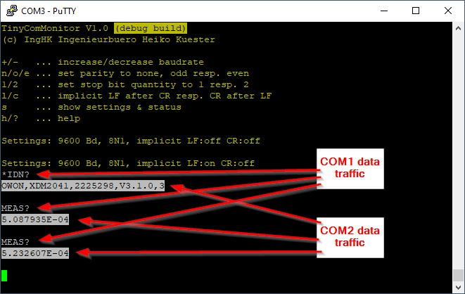
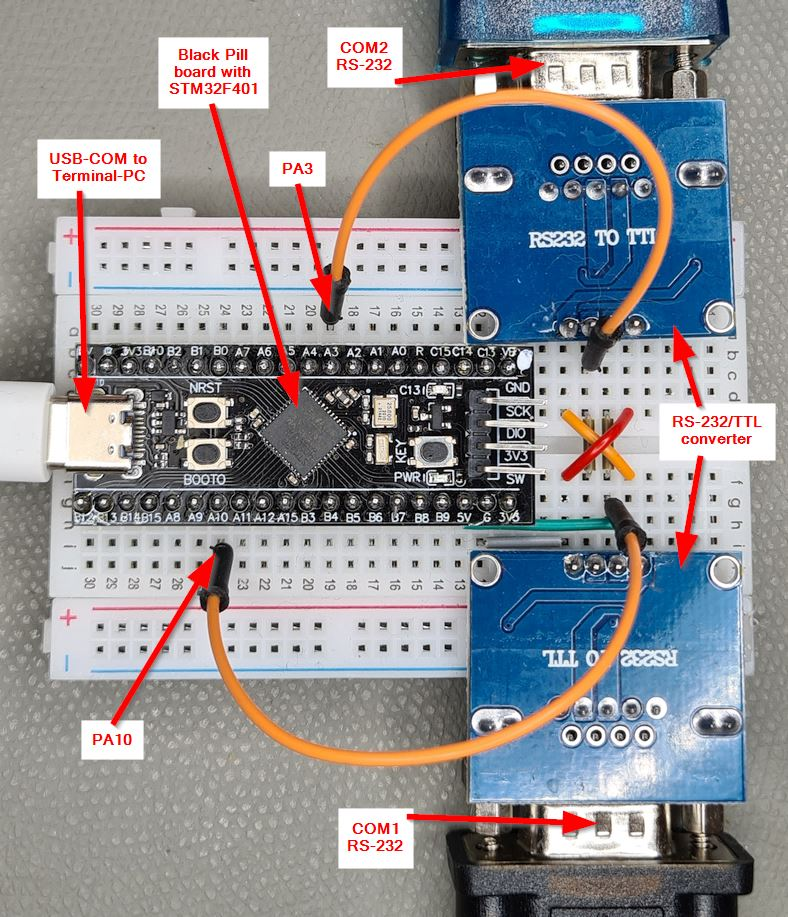
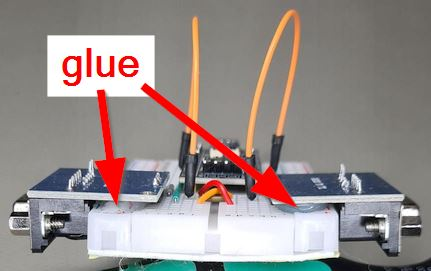
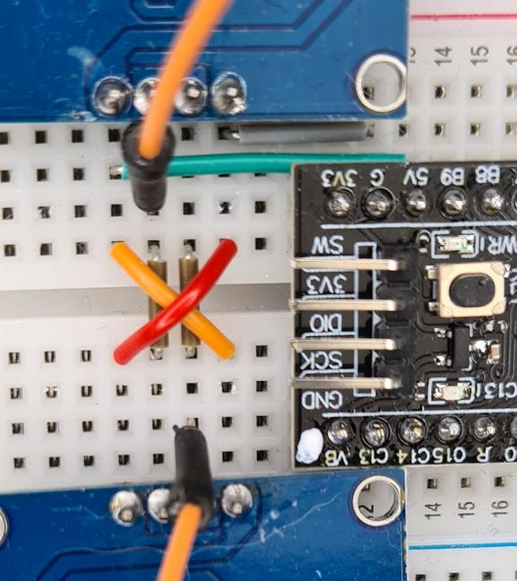

# TinyComMonitor

## Introduction

TinyComMonitor is a small tool to monitor data traffic flowing over [serial COM interfaces](https://en.wikipedia.org/wiki/Serial_port) ([UARTs](https://en.wikipedia.org/wiki/Universal_asynchronous_receiver-transmitter)) like RS-232, RS-485, RS-422, TTL, ...

Example of monitoring outputs: 

## TinyComMonitor...

* consists of hardware that is connected to the full-duplex COM lines (UARTs), monitors the data traffic and visualizes them on a terminal computer e.g. with PuTTY as terminal software
* can monitor each kind of serial line physic (e.g. RS-232, RS-485, RS-422, TTL, ...)   
* uses cheap and easy procurable hardware components and is simple to assemble on a breadboard
* runs on the widely used [WeAct Studio *Black Pill*](https://github.com/WeActStudio/WeActStudio.MiniSTM32F4x1) board with the [STM32F401 microcontroller](https://www.st.com/en/microcontrollers-microprocessors/stm32f401.html) and this project provides the ready-to-flash binary firmware file

## Features

* outputs in terminal program
  * easy to understand outputs in terminal software (normal outputs for COM1 and inverse outputs for COM2)
  * overflow detection (red outputs)
  * acts as standard (virtual) USB COM port connected via USB to the terminal PC 
  * requires a VT-100 supporting terminal program (e.g. [PuTTY](https://www.putty.org/))
* usage
  * COM parameter adjustable via terminal software (baudrate, stop bits, parity)
  * implicit carriage return (CR) or linefeed (LF) addable
* supported COM (UART) line settings
  * 600 - 921,600 Baud
  * 8 data bits
  * 1 or 2 stop bits
  * none, odd, even parity
* monitoring
  * passive monitoring without having any influence to the serial lines and traffic
  * monitoring of both directions of a full-duplex serial link (e.g. PC <=> SCPI-measurement-instrument with request/answer protocol)   
  * can monitor each kind of serial line hardware (e.g. RS-232, RS-485, RS-422, TTL, ...) using a corresponding *PHY* converter board
  
## Limitations and notes

TinyComMonitor uses (currently) an USB Full Speed connection to the terminal computer with max. 12 Mbit/s brutto.
Data overflow can occur if larger amounts of data streams on the full-duplex COM lines to be monitored than can then be transported to the terminal computer via USB.
TinyComMonitor (currently) uses a 1024 byte buffer to buffer data bursts, but with longer data streams a buffer overflow can occur, which is displayed as a red block in the terminal program.

Take care about the maximum baudrate support by the *PHY* converter, which can be lower than 921600 Baud.
The below described RS-232 hardware setup uses normally the [MAX3232](https://www.analog.com/en/products/max3232.html) (or a clone), which supports only up to 250 kBaud.

### Advices

* connect the *Black Pill* board directly to a USB port of the terminal PC. Several USB device connected to PC via USB 2.0 Hubs share the USB bandwith 

## Setup

### Hardware

#### Parts list

* 1x "Black Pill" board with STM32F401 (WeACT or clone)
* 2x RS232/TTL or RS-422/TTL converter (receiver) modules
* breadboard and jumpers

#### Connections

* connected the 1st COM line to be monitored to PA10 and the 2nd to PA3 of the *Black Pill* board (and don't forget to connect GND)
* if you want to monitor only one COM line, you can leave the unused PAx port unconnected. The STM32F401 has activated internal weak pull-up resistor
* PAx of the STM32F401 are TTL inputs and 5V tolerant
* avoid driving TTL signals into *Black Pill* board, if it's unpowered. Otherwise insert 100 ohm resistors into the PAx lines to protect the STM32F401 against damage (may reduce maximum baud rate)
* if non-TTL signals have to be monitored, insert matching *PHY* converters into the lines
* the *PHY* converters can be powered by the 5V output of the *Black Pill* board, which is again powered by it's USB port. The 3V3 output has weak current capability and should be avoided

#### Example RS-232 setup

**Notes:**

* this setup is certainly a bit strange because the RS-232 signals are first converted into TTL and then back into RS-232, but this structure can be implemented "quick and dirty" with very inexpensive and widely available RS-232/TTL converters.
* for a robust structure, it is recommended to glue the converter modules to the breadboard using hot glue.

### Software

1. Flash [Release/TinyComMonitor.hex](Release/TinyComMonitor.hex) into *Black Pill* board using [STM32CubeProgrammer software](https://www.st.com/en/development-tools/stm32cubeprog.html) via USB. After programming the STM32 acts and is visible as serial (COM) USB device in the device manager of the terminal PC
2. Start PuTTY (or any other VT-100 supporting terminal software) and connect to the serial USB device COMx (x is a number). The connection settings of the serial USB device are irrelevant and can be set arbitrarily. These have nothing to do with the connection settings of the COM lines to be monitored

## Licenses

* TinyComMonitor (folders [TinyComMonitor](TinyComMonitor), [Images](Images), [Release](Release) and [Testdata](Testdata)): GPL-3.0
* [STM32CubeF4 MCU Firmware Package](https://github.com/STMicroelectronics/STM32CubeF4) (folders [Core](Core), [Drivers](Drivers), [Middlewares](Middlewares) and [USB_DEVICE](USB_DEVICE)) is provided by [ST](https://www.st.com/content/st_com/en.html): see file headers and license files there  

## Feedback and Contribution

Everyone is invited to give feedback, suggest improvements and collaborate on the project.
Please use the github functions to do this or send me an [email](mailto:TinyComMonitor@hkue.de)

## Changelog

### V1.0 2023-12-18

* initial version
